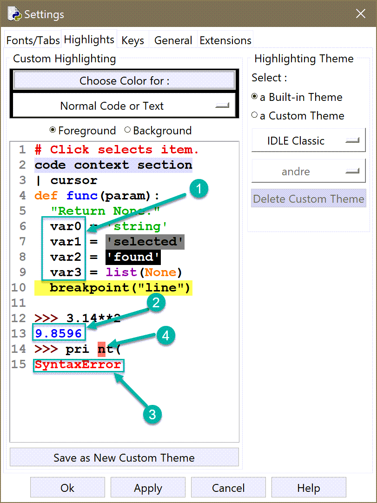

IDLE's colours
==============

In most other programs where colour output is possible,
friendly uses Rich and pygments, either directly or indirectly,
to add colour. This is not possible when using IDLE.

Idle provides a few pre-defined element types to which colouring
can be applied.

In the default scheme:

1. The default colour is black.
2. Anything "printed" normally (``print() --> sys.stdout``) is in blue.
3. Anything printed following an exception (sent to ``sys.stderr``) is in red.
4. IDLE uses a red background to highlight a specific position of a syntax error
   as identified by Python.

Friendly makes use of the colours chosen for these four basic
elements when it formats the information presented to the user.
The specific colour used for each of these cases can be changed
using IDLE's 'Options->Configure IDLE' menu item.
