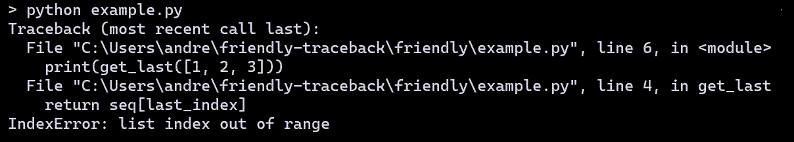
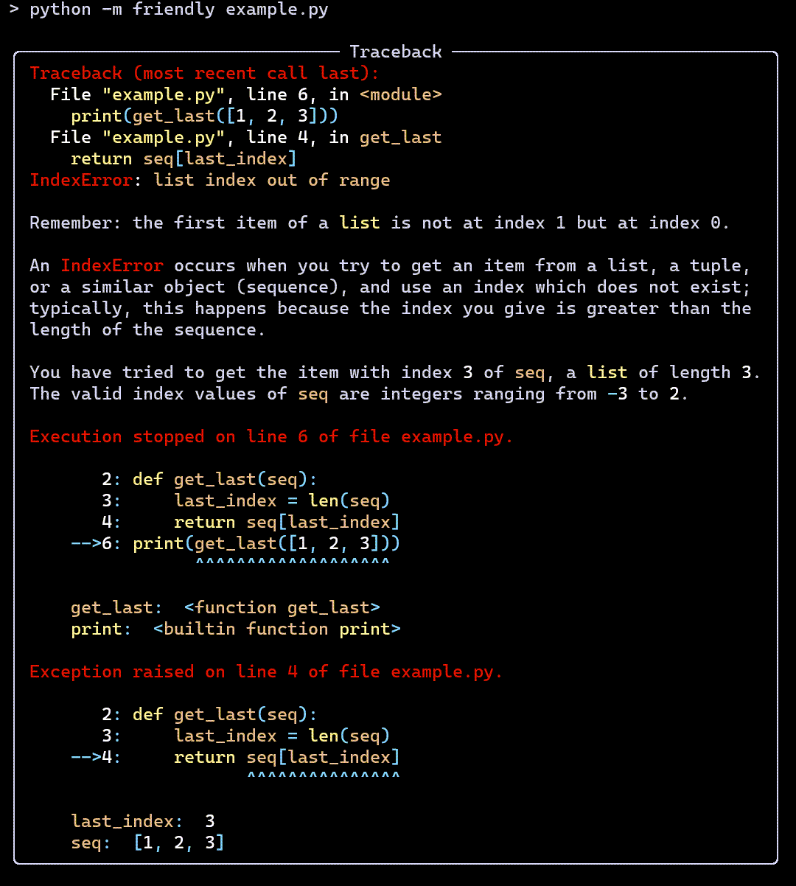
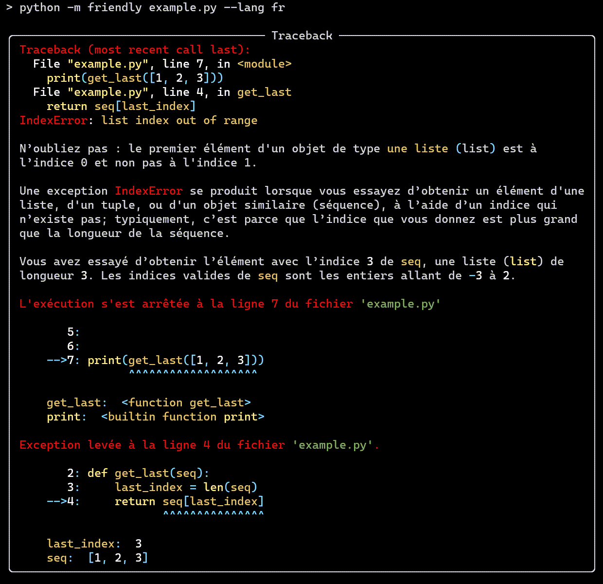

`Code on Github <https://github.com/friendly-traceback>`_

.. image:: friendly_logo.png
   :class: sidebar-logo

Bienvenue 환영합니다 Bienvenido - ようこそ Welcome  歡迎光臨
========================================================================

**Friendly** helps users understand what caused a given
exception in their Python program, and how to fix it.
**Friendly**, with an uppercase **F**
refers to two related packages: **friendly-traceback** and **friendly**.

.. tab:: friendly-traceback

    **friendly-traceback** does all the work to figure out what caused
    a particular exception and does some basic formatting of the
    information it obtains.

.. tab:: friendly

    **friendly** takes the information obtained by **friendly-traceback**
    and applies some formatting (most often, adding colours) which often
    makes the information easier to understand.

Introduction
-------------

There exists many Python projects
whose **primary** goal is to supplement the information
given by Python traceback to make them more useful for **advanced** programmers.
To my knowledge, of all those projects, **Friendly** is
the only one designed with beginners in mind.

To be more specific, while **Friendly**
can be useful for advanced programmers,
it strives to present the information in a way that is easily
understood by beginners and/or by users
who would like to get information about traceback in their own language.
**Friendly** can give more detailed information as to
**where** an exception occurred, **what** a given exception means and
**why** it might have occurred (sometimes adding suggestions as to how to fix it.)

.. sidebar:: Using screenshots

    In this documentation, I most often use some screenshots,
    as I believe that they are more easily understandable by most users.
    Occasionally, I write some examples as text so that they
    can provide the required information to people relying on screen readers.
    If you rely on screen readers and need help because the use of screenshots
    prevents you from understanding the explanations, please do not hesitate to
    reach out to me: andre.roberge@gmail.com

Even though **Friendly** can be used on its own with a specially
designed console, a better option might be to use it together with
GUI-based editors/IDE including JupyterLab and Jupyter notebooks.
I explain how to do so later.
For now, I'll just show one quick example.

A quick look
------------

Consider the following program::

    # example.py
    def get_last(seq):
        last_index = len(seq)
        return seq[last_index]

    print(get_last([1, 2, 3]))

First, here is what happens when I use Python
to run this program.

Not exactly the most helpful information for beginners ...

Here's the corresponding version with full explanation from friendly,
making use of
`Rich <https://github.com/willmcgugan/rich>`_ to produce a colourful output.

One unique feature of friendly is that all the information
it provides can be translated into another language; currently, only
English (by default) and French are available but other languages
could easily be added.

**Keep reading if you want to find out more.**

.. toctree::
   :maxdepth: 1
   :hidden:
   :caption: Begin here

   beginner
   install
   usage
   when_ft

.. toctree::
   :maxdepth: 1
   :hidden:
   :caption: friendly console

   repl
   why
   what
   where
   explain
   www
   history
   friendly_object
   repl_api
   about_warnings

.. toctree::
   :maxdepth: 1
   :hidden:
   :caption: Why import *?

   import_all

.. toctree::
   :maxdepth: 1
   :hidden:
   :caption: IDLE

   idle
   idle_repl
   idle_run

.. toctree::
   :maxdepth: 1
   :hidden:
   :caption: Mu

   mu_about
   mu_install
   mu_repl
   mu_run

.. toctree::
   :maxdepth: 1
   :hidden:
   :caption: Other consoles

   pyrepl
   vs_code_repl
   ipython_repl
   other_repl

.. toctree::
   :maxdepth: 1
   :hidden:
   :caption: Editors and Notebooks

   install_thonny
   editor
   jupyter
   vs_code
   colab

.. toctree::
   :maxdepth: 1
   :hidden:
   :caption: Thoughts on design

   design
   themes
   multiple_tracebacks
   friendly_tb
   ipython_tb
   jupyter_tb
   numbered_prompt
   idle_colours

.. toctree::
   :maxdepth: 1
   :hidden:
   :caption: Use in your project

   api
   formatter
   custom_errors
   usage_adv
   plugins

.. toctree::
   :maxdepth: 1
   :hidden:
   :caption: Contribute

   suggest
   translation_notes

.. toctree::
   :maxdepth: 1
   :hidden:
   :caption: All the tracebacks!

   known
   friendly tracebacks - Python 3.6 in English <tracebacks_en_3.6>
   SyntaxError - Python 3.6 in English <syntax_tracebacks_en_3.6>
   friendly tracebacks - Python 3.7 in English <tracebacks_en_3.7>
   SyntaxError - Python 3.7 in English <syntax_tracebacks_en_3.7>
   friendly tracebacks - Python 3.8 in English <tracebacks_en_3.8>
   SyntaxError - Python 3.8 in English <syntax_tracebacks_en_3.8>
   friendly tracebacks - Python 3.9 in English <tracebacks_en_3.9>
   SyntaxError - Python 3.9 in English <syntax_tracebacks_en_3.9>
   friendly tracebacks - Python 3.10 in English <tracebacks_en_3.10>
   SyntaxError - Python 3.10 in English <syntax_tracebacks_en_3.10>
   compare_exceptions
   compare

.. toctree::
   :maxdepth: 1
   :hidden:
   :caption: En français

   tracebacks_fr
   syntax_tracebacks_fr
